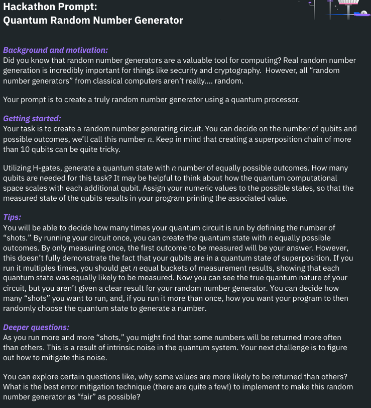
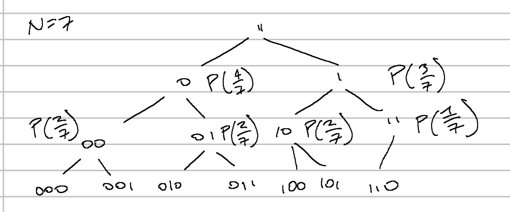
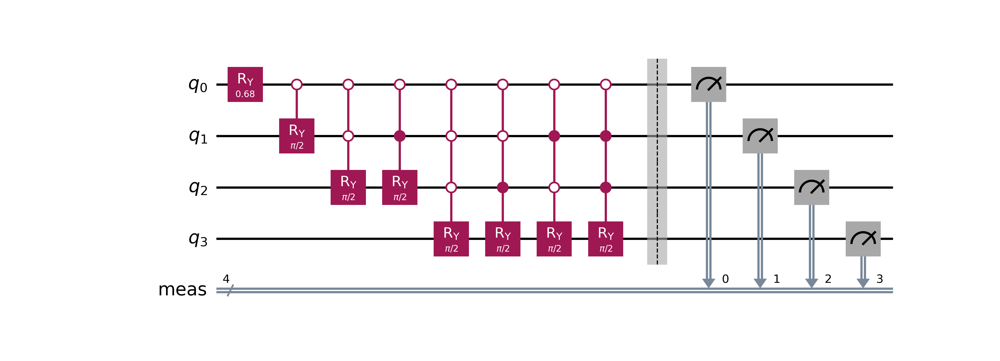

# Quantum RNG 

# Prompt

In this project for QiskitFest@UCLA, we implement a Quantum random number generator that uniformly samples $0...N$ in the fewest number of qubits and gates as possible. We include 4 sample circuits ranging from a naiive implementation to the most optimal design. 

# Preliminaries:

Quickly, this problem of sampling $0..N$ is trivial for the case $N = 2^k$, since we can use a series of Hadamard transforms to evenly split the amplitudes across all $2^k$ computational basis states. Each Hadamard gate doubles the number of possible outcomes, creating a uniform superposition where every basis state has equal probability $1/2^k$. This only becomes interesting when $N$ isn't just a power of $2$, for which we explore a series of circuit constructions.

# V0: Naiive Control

In this circuit, we manually set the probabilities of each qubit using cascaded $R_y$ rotations, but this approach quickly becomes impractical. Each new qubit requires multiple controlled rotations whose angles depend on all previous qubits, causing the gate count and circuit depth to grow quadratically. These controlled rotations are also error-prone and hardware-expensive, and the precise rotation values are hard to compute or calibrate.

# V1: Binary Expansion 

Since for powers of 2, building a uniform sampler is straightforward using Hadamard gates, we instead view $N$ as a sum of powers of two, $N = 2^{k_1} + 2^{k_2} + \cdots + 2^{k_m}$. By constructing uniform superpositions for each $2^{k_i}$ block and combining them with conditional rotations, we can approximate a uniform distribution over $0...N-1$ while keeping the circuit shallow and efficient.

### Example
Here is an example of the breakdown for $N = 7$: 

And here is the corresponding circuit representation 

We recursively sample over $N = 7$ states as a binary tree of conditional probabilities. At each branching point, the circuit applies a rotation that splits the amplitude proportionally to how many valid states remain in each subtree.

For instance, the first qubit has probability $P(4/7)$ of being $|0\rangle$ and $P(3/7)$ of being $|1\rangle$. These are then recursively refined until all of the basis states are assigned equal amplitude. 

### Some Math 
> For the first qubit, we want to split the probability mass between the left and right branches according to how many valid states lie under each. 
> $$
> P(0) = \frac{4}{7}, \quad P(1) = \frac{3}{7}.
> $$
> An $R_y(\theta)$ gate on $|0\rangle$ prepares
> $$
> R_y(\theta)|0\rangle = \cos\left(\frac{\theta}{2}\right)|0\rangle + \sin\left(\frac{\theta}{2}\right)|1\rangle,
> $$
> giving probabilities $\cos^2(\frac{\theta}{2})$ and $\sin^2(\frac{\theta}{2})$. Setting $\cos^2(\frac{\theta}{2}) = \frac{4}{7}$ yields
> $$
> \boxed{\theta = 2\arccos\sqrt{\frac{4}{7}} = 2\arcsin\sqrt{\frac{3}{7}}.}
> $$

# V2: Consolidating Hadamards

Since the Hadamard gate is unitary, applying it twice yields the identity operation $H^\dagger H = I$. Previously, we used a Hadamard gate with a control to emulate an anti-control, but since H is self-inverse, we can simplify the circuit by directly using an anti-control instead, reducing unnecessary gates.

# V3: Complement Graph

This approach first builds a fully balanced superposition over $2^k$ states using Hadamard gates, then applies conditional $R_y$ rotations to correct the amplitudes for $N < 2^k$. The Hadamard layer creates an even base distribution, while the correction step prunes invalid branches, creating an even more compact circuit. 

### Example

For $N=9$, where the first split is $N_0=8$ and $N_1=1$, the rotation angle is

$$\theta = 0.680 \text{ rad},$$

so relative to a Hadamard baseline ($\pi/2$), the correction is

$$\Delta\theta = -0.891 \text{ rad}.$$

# V4: Log-depth Hadamard Expansion

In this version, instead of explicitly using control and anti-control gates to adjust every possible branch of the power-of-two subcircuits, we exploit the symmetry of the balanced tree. Each Hadamard gate naturally produces an even split between its 0 and 1 branches, so by cascading only $\log N$ Hadamards, we implicitly generate all balanced subtrees without enumerating them. The remaining corrections are then applied only where the ideal 50–50 split fails (i.e., at boundaries of the valid $N$ range).

# Open Question

The complement approach scales roughly linearly with the number of invalid states, requiring $O(2^k - N)$ correction gates. This makes it ideal when $N$ is just below a power of two, since only a few amplitudes need to be removed. However, as $N$ moves further away from $2^k$, that linear term grows toward $O(2^k)$, quickly becoming inefficient. In contrast, the Hadamard tree method has logarithmic scaling—about $O(\log N)$ Hadamards and $O(\log N)$ corrections—independent of how far $N$ is from $2^k$. Thus, the complement approach is best for $N \approx 2^k$, while the Hadamard tree approach is superior for smaller $N$. A future direction is to investigate the bounds on the number of gates and when which approach is better than the other. 

